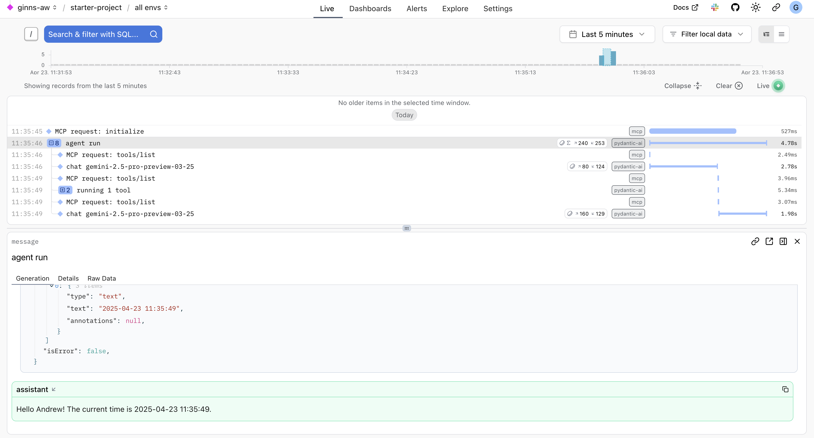
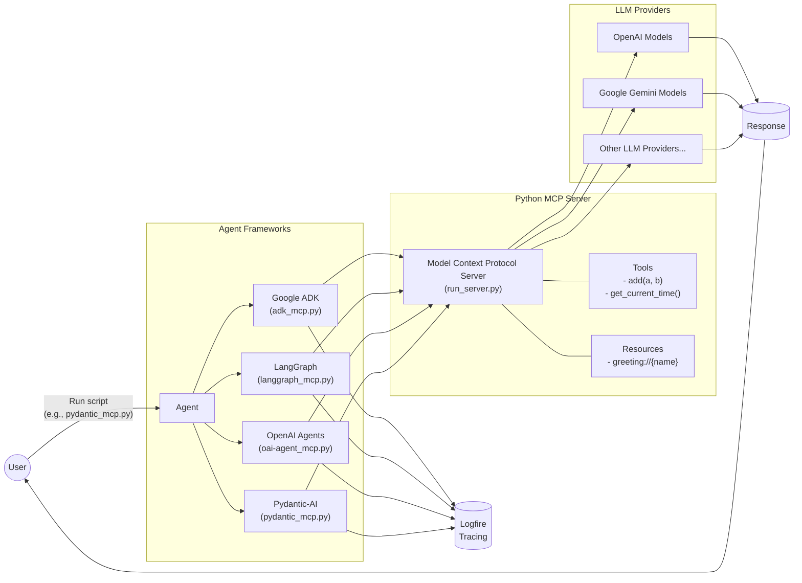
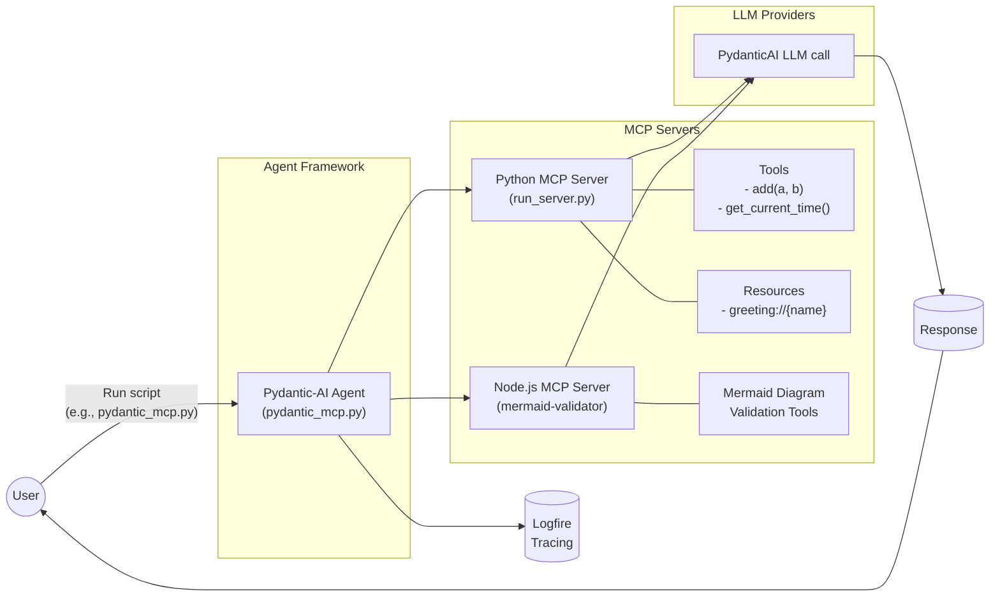

# Model Context Protocol (MCP) Agent Frameworks Demo

This repository demonstrates LLM Agents using tools from Model Context Protocol (MCP) servers with several frameworks:
- Google Agent Development Kit (ADK)
- LangGraph Agents
- OpenAI Agents
- Pydantic-AI Agents

Both single and multiple MCP server examples are demonstrated
- [Agent with a single MCP server](agents_mcp_usage/basic_mcp/README.md)
- [Agent with multiple MCP servers](agents_mcp_usage/multi_mcp/README.md)
  - Also includes Agent evaluations

The repo also includes a Python MCP Server [`run_server.py`](run_server.py) based on [MCP Python SDK Quickstart](https://github.com/modelcontextprotocol/python-sdk/blob/b4c7db6a50a5c88bae1db5c1f7fba44d16eebc6e/README.md?plain=1#L104)
- Modified to include a datetime tool and run as a server invoked by Agents

Tracing is done through Pydantic Logfire.


# Quickstart

`cp .env.example .env`
- Add `GEMINI_API_KEY` and/or `OPENAI_API_KEY`
  - Individual scripts can be adjusted to use models from any provider supported by the specific framework
    - By default only [basic_mcp_use/oai-agent_mcp.py](agents_mcp_usage/basic_mcp/basic_mcp_use/oai-agent_mcp.py) requires `OPENAI_API_KEY`
    - All other scripts require `GEMINI_API_KEY` (Free tier key can be created at https://aistudio.google.com/apikey)
- [Optional] Add `LOGFIRE_TOKEN` to visualise evaluations in Logfire web ui

Run an Agent framework script e.g.:
- `uv run agents_mcp_usage/basic_mcp/basic_mcp_use/pydantic_mcp.py`
  - Requires `GEMINI_API_KEY` by default

- `uv run agents_mcp_usage/basic_mcp/basic_mcp_use/oai-agent_mcp.py`
  - Requires `OPENAI_API_KEY` by default

Check console or Logfire for output

## Project Overview

This project aims to teach:
1. How to use MCP with multiple LLM Agent frameworks
    - Agent using a single MCP server ([basic_mcp](#basic-mcp-single-server-usage))
    - Agent using multiple MCP servers ([multi_mcp](#multi-mcp-advanced-usage))
2. How to see traces LLM Agents with Logfire
3. How to evaluate LLMs with PydanticAI evals



## Repository Structure

- **[agents_mcp_usage/basic_mcp/](agents_mcp_usage/basic_mcp/)** - Single MCP server integration examples
  - **basic_mcp_use/** - Contains basic examples of single MCP usage:
    - `adk_mcp.py` - Example of using MCP with Google's Agent Development Kit (ADK)
    - `langgraph_mcp.py` - Example of using MCP with LangGraph
    - `oai-agent_mcp.py` - Example of using MCP with OpenAI Agents
    - `pydantic_mcp.py` - Example of using MCP with Pydantic-AI

  - **eval_basic_mcp_use/** - Contains evaluation examples for single MCP usage:
    - `evals_adk_mcp.py` - Evaluation of MCP with Google's ADK
    - `evals_langchain_mcp.py` - Evaluation of MCP with LangGraph
    - `evals_pydantic_mcp.py` - Evaluation of MCP with Pydantic-AI

- **[agents_mcp_usage/multi_mcp/](agents_mcp_usage/multi_mcp/)** - Advanced multi-MCP server integration examples
  - **multi_mcp_use/** - Contains examples of using multiple MCP servers simultaneously:
    - `pydantic_mcp.py` - Example of using multiple MCP servers with Pydantic-AI Agent
  - **eval_multi_mcp/** - Contains evaluation examples for multi-MCP usage:
    - `evals_pydantic_mcp.py` - Example of evaluating the use of multiple MCP servers with Pydantic-AI

- **Demo Python MCP Server**
  - `run_server.py` - Simple MCP server that runs locally, implemented in Python

## Basic MCP: Single Server Usage

The `basic_mcp` directory demonstrates how to integrate a single MCP server with different agent frameworks. Each example follows a similar pattern:

1. **Environment Setup**: Loading environment variables and configuring logging
2. **Server Connection**: Establishing a connection to the local MCP server
3. **Agent Configuration**: Setting up an agent with the appropriate model
4. **Execution**: Running the agent with a query and handling the response

The MCP server in these examples provides:
- An addition tool (`add(a, b)`)
- A time tool (`get_current_time()`) 
- A dynamic greeting resource (`greeting://{name}`)

### Basic MCP Architecture



#### Try the Basic MCP Examples:

```bash
# Google ADK example
uv run agents_mcp_usage/basic_mcp/basic_mcp_use/adk_mcp.py

# LangGraph example
uv run agents_mcp_usage/basic_mcp/basic_mcp_use/langgraph_mcp.py

# OpenAI Agents example
uv run agents_mcp_usage/basic_mcp/basic_mcp_use/oai-agent_mcp.py

# Pydantic-AI example
uv run agents_mcp_usage/basic_mcp/basic_mcp_use/pydantic_mcp.py
```

More details on basic MCP implementation can be found in the [basic_mcp README](agents_mcp_usage/basic_mcp/README.md).

## Multi-MCP: Advanced Usage

The `multi_mcp` directory demonstrates advanced techniques for connecting to and coordinating between multiple specialised MCP servers simultaneously. This approach offers several advantages:

1. **Domain Separation**: Each MCP server can focus on a specific domain or set of capabilities
2. **Modularity**: Add, remove, or update capabilities without disrupting the entire system
3. **Scalability**: Distribute load across multiple servers for better performance
4. **Specialisation**: Optimise each MCP server for its specific use case

### Multi-MCP Architecture



#### Try the Multi-MCP Examples:

```bash
# Run the Pydantic-AI multi-MCP example
uv run agents_mcp_usage/multi_mcp/multi_mcp_use/pydantic_mcp.py

# Run the multi-MCP evaluation
uv run agents_mcp_usage/multi_mcp/eval_multi_mcp/evals_pydantic_mcp.py
```

More details on multi-MCP implementation can be found in the [multi_mcp README](agents_mcp_usage/multi_mcp/README.md).

## What is MCP?

The Model Context Protocol allows applications to provide context for LLMs in a standardised way, separating the concerns of providing context from the actual LLM interaction.

Learn more: https://modelcontextprotocol.io/introduction

## Why MCP

By defining clear specifications for components like resources (data exposure), prompts (reusable templates), tools (actions), and sampling (completions), MCP simplifies the development process and fosters consistency.

A key advantage highlighted is flexibility; MCP allows developers to more easily switch between different LLM providers without needing to completely overhaul their tool and data integrations. It provides a structured approach, potentially reducing the complexity often associated with custom tool implementations for different models. While frameworks like Google Agent Development Kit, LangGraph, OpenAI Agents, or libraries like PydanticAI facilitate agent building, MCP focuses specifically on standardising the interface between the agent's reasoning (the LLM) and its capabilities (tools and data), aiming to create a more interoperable ecosystem.

## Setup Instructions

1. Clone this repository
2. Install required packages:
   ```bash
   make install
   ```
3. Set up your environment variables in a `.env` file:
   ```
   LOGFIRE_TOKEN=your_logfire_token
   GEMINI_API_KEY=your_gemini_api_key
   OPENAI_API_KEY=your_openai_api_key
   ```
4. Run any of the sample scripts as shown in the examples above

## About Logfire

[Logfire](https://github.com/pydantic/logfire) is an observability platform from the team behind Pydantic that makes monitoring AI applications straightforward. Features include:

- Simple yet powerful dashboard
- Python-centric insights, including rich display of Python objects
- SQL-based querying of your application data
- OpenTelemetry support for leveraging existing tooling
- Pydantic integration for analytics on validations

Logfire gives you visibility into how your code is running, which is especially valuable for LLM applications where understanding model behaviour is critical.