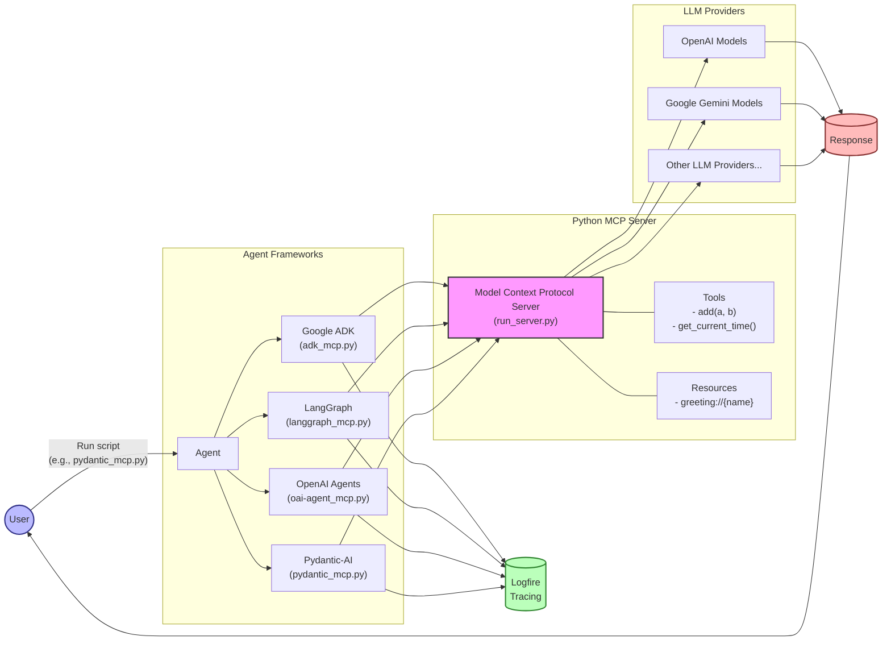

# Basic MCP Usage Examples

This directory contains examples of integrating Model Context Protocol (MCP) with various LLM agent frameworks.

Each script demonstrates how to connect to a single local MCP server and use it with a different agent framework.

### Basic MCP Architecture



The diagram illustrates how MCP serves as a standardised interface between different agent frameworks and LLM providers.The flow shows how users interact with the system by running a specific agent script, which then leverages MCP to communicate with LLM providers, while Logfire provides tracing and observability.

### Google Agent Development Kit (ADK)

**File:** `adk_mcp.py`

This example demonstrates how to use MCP with Google's Agent Development Kit (ADK).

```bash
uv run agents_mcp_usage/basic_mcp/basic_mcp_use/adk_mcp.py
```

Key features:
- Uses `MCPToolset` for connecting to the MCP server
- Configures a Gemini model using ADK's `LlmAgent`
- Sets up session handling and runner for agent execution
- Includes Logfire instrumentation for tracing

### LangGraph

**File:** `langgraph_mcp.py`

This example demonstrates how to use MCP with LangGraph agents.

```bash
uv run agents_mcp_usage/basic_mcp/basic_mcp_use/langgraph_mcp.py
```

Key features:
- Uses LangChain MCP adapters to load tools
- Creates a ReAct agent with LangGraph
- Demonstrates stdio-based client connection to MCP server
- Uses Gemini model for agent reasoning

### OpenAI Agents

**File:** `oai-agent_mcp.py`

This example demonstrates how to use MCP with OpenAI's Agents package.

```bash
uv run agents_mcp_usage/basic_mcp/basic_mcp_use/oai-agent_mcp.py
```

Key features:
- Uses OpenAI's Agent and Runner classes
- Connects to MCP server through MCPServerStdio
- Uses OpenAI's o4-mini model
- Includes Logfire instrumentation for both MCP and OpenAI Agents

### Pydantic-AI

**File:** `pydantic_mcp.py`

This example demonstrates how to use MCP with the Pydantic-AI agent framework.

```bash
uv run agents_mcp_usage/basic_mcp/basic_mcp_use/pydantic_mcp.py
```

Key features:
- Uses the simplified Pydantic-AI Agent interface
- Configures MCPServerStdio for MCP communication
- Employs context manager for server lifecycle management
- Includes comprehensive instrumentation for both MCP and Pydantic-AI


## Understanding the Examples

Each example follows a similar pattern:

1. **Environment Setup**: Loading environment variables and configuring logging
2. **Server Connection**: Establishing a connection to the local MCP server
3. **Agent Configuration**: Setting up an agent with the appropriate model
4. **Execution**: Running the agent with a query and handling the response

The examples are designed to be as similar as possible, allowing you to compare how different frameworks approach MCP integration.

## MCP Server

All examples connect to the same MCP server defined in `run_server.py` at the project root. This server provides:

- An addition tool (`add(a, b)`)
- A time tool (`get_current_time()`) 
- A dynamic greeting resource (`greeting://{name}`)

You can modify the MCP server to add your own tools and resources for experimentation. 