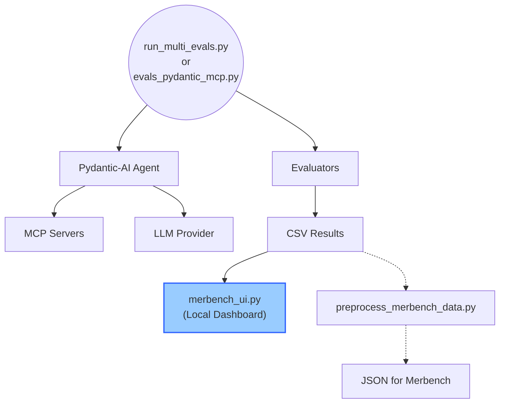

# Mermaid Diagram Evaluation System

A benchmarking system for evaluating LLM agents' ability to fix syntactically incorrect Mermaid diagrams using Model Context Protocol (MCP) servers.

**Key Features:**
- 🎯 Tests three difficulty levels of invalid Mermaid diagrams
- 🔧 Utilises multiple MCP servers for validation and syntax errors
- 📊 Comprehensive evaluation metrics and scoring
- 🏆 Live leaderboard at <https://andrew.ginns.uk/merbench>

## Architecture



## Quick Overview

* **Test cases**: 3 invalid Mermaid diagrams (easy/medium/hard)
* **Success metric**: Diagram syntax validity (100% = all cases pass)
* **Evaluation runners**: 
  - `evals_pydantic_mcp.py` - Single-model evaluation
  - `run_multi_evals.py` - Multi-model parallel evaluation
* **Results visualisation**: 
  - `merbench_ui.py` - Local Streamlit dashboard (recommended)
  - CSV → JSON → Public web dashboard (optional)
* **Performance scoring**: Based solely on diagram validity (LLMJudges implemented but not scored)

## Prerequisites & Setup

### Requirements
- Python 3.11+
- [`uv`](https://github.com/astral-sh/uv) for dependency management

### Installation
```bash
# Install all dependencies
uv sync
```

### Configuration
The evaluation system uses Pydantic-AI and requires environment variables for API keys:
```bash
# Required for most models
export GEMINI_API_KEY="your-key-here"

# Optional for specific models
export OPENAI_API_KEY="your-key-here"
```

## Quick Start Guide

### 1. Run a Single-Model Evaluation
```bash
# Test a specific model (defaults to gemini-2.5-flash)
uv run agents_mcp_usage/evaluations/mermaid_evals/evals_pydantic_mcp.py
```

### 2. Run Multi-Model Benchmarking
```bash
# Run evaluation across multiple models in parallel
uv run agents_mcp_usage/evaluations/mermaid_evals/run_multi_evals.py
```

### 3. View Results in Local Dashboard (Recommended)
```bash
# Launch the interactive Streamlit dashboard to visualise your results
make leaderboard

# Or run directly:
uv run streamlit run agents_mcp_usage/evaluations/mermaid_evals/merbench_ui.py
```

The local dashboard (`merbench_ui.py`) provides:
- 📊 Interactive leaderboards and performance metrics
- 📈 Pareto frontier visualisations (performance vs cost/tokens)
- 🔍 Deep dive analysis with success rates and failure patterns
- 💰 Configurable model costs
- 🎯 Advanced filtering by provider, model, and test case

### 4. Export Results for Web Dashboard (Optional)
```bash
# Convert CSV results to JSON format for the public Merbench website
uv run agents_mcp_usage/evaluations/mermaid_evals/scripts/preprocess_merbench_data.py \
  mermaid_eval_results/<timestamp>_combined_results.csv \
  agents_mcp_usage/evaluations/mermaid_evals/results/<timestamp>_processed.json
```

## Evaluation Task & Test Cases

The system challenges LLM agents to:
1. **Identify and fix syntax errors** in invalid Mermaid diagrams
2. **Utilise MCP servers** for validation and enhancement
3. **Handle errors gracefully** with proper categorisation
4. **Provide meaningful failure reasons** for debugging

### Test Case Difficulty Levels

1. **Easy** (2 syntax errors)
   - Incorrect node references (`GEMINI` vs `GEM`)
   - Minor naming inconsistencies
   - Example: `MCP --> GEMINI` where `GEMINI` is undefined

2. **Medium** (7 syntax errors)
   - Invalid comment syntax (using `#` instead of `%%`)
   - Malformed arrows with spaces (`-- >` instead of `-->`)
   - Direction inconsistencies (`TB` vs `TD`)
   - Example: `LG -- > MCP` has invalid spacing in arrow

3. **Hard** (Complex structural errors)
   - Multiple comment syntax errors
   - Arrow spacing issues throughout
   - Complex nested subgraph problems
   - Requires understanding of overall diagram structure

### Example Error Types
```mermaid
%% Invalid examples from actual test cases:
graph LR
    %% Error 1: Space in arrow
    A -- > B  %% Should be: A --> B
    
    %% Error 2: Undefined node reference
    C --> UNDEFINED_NODE  %% Node doesn't exist
    
    %% Error 3: Wrong comment syntax
    # This is wrong  %% Should use %%
```

## Output Schema & Metrics

### MermaidOutput Schema
```python
class MermaidOutput(BaseModel):
    fixed_diagram: str           # The corrected mermaid diagram
    failure_reason: str = ""     # Why the case failed (if applicable)
    metrics: Dict[str, Any] = {} # Usage metrics from the LLM
    tools_used: List[str] = []   # Which MCP tools were called
```

### Captured Metrics
- **`requests`** - Number of API requests made
- **`request_tokens`** - Total tokens in requests
- **`response_tokens`** - Total tokens in responses
- **`total_tokens`** - Sum of request and response tokens
- **`details`** - Additional model-specific usage details

## Evaluation Criteria

### 1. **MermaidDiagramValid** (Primary Score)
- **Weight**: 100% of final score
- **Purpose**: Validates diagram syntax using MCP server
- **Score**: 1.0 (valid) or 0.0 (invalid)

### 2. **UsedBothMCPTools**
- **Purpose**: Tracks MCP server utilisation
- **Scoring**:
  - 1.0: Used both servers (example + validator)
  - 0.5: Used only one server
  - 0.0: No MCP tool usage

### 3. **UsageLimitNotExceeded**
- **Purpose**: Detects token limit failures
- **Score**: 1.0 (success) or 0.0 (limit exceeded)

### 4. **LLMJudge Evaluators** (Not scored)
- **Format Check**: Response contains only Mermaid diagram
- **Structure Check**: Maintains original diagram intent

## MCP Servers

### 1. Example Server (`mcp_servers/example_server.py`)
- **Purpose**: Provides utility tools
- **Features**: Time functions for adding timestamps

### 2. Mermaid Validator (`mcp_servers/mermaid_validator.py`)
- **Purpose**: Validates Mermaid syntax
- **Features**: Returns detailed error messages

## Error Handling

### Failure Categories

**Agent-level failures:**
- `usage_limit_exceeded` - Token limit reached
- `response_validation_failed` - Invalid output format
- `agent_timeout` - Execution timeout
- `http_error_*` - HTTP status errors
- `connection_error` - Network issues

**Evaluation-level failures:**
- `evaluation_timeout` - Overall timeout
- `model_api_error` - API authentication/access
- `evaluation_error_{ExceptionType}` - Unexpected errors

### Retry Strategy
- **Attempts**: 3 retries for transient errors
- **Backoff**: Exponential (1s → 2s → 4s)
- **Jitter**: ±50% randomisation
- **Max delay**: 30 seconds
- **Retryable**: HTTP 429/5xx, network errors, OSError
- **Non-retryable**: HTTP 4xx (except 429), validation errors

## Output Files

### Directory Structure
```
mermaid_eval_results/                                     # Default output directory
├── YYYY-MM-DD_HH-MM-SS_mermaid_results_{model}.csv      # Single model
├── YYYY-MM-DD_HH-MM-SS_individual_{model}.csv           # Multi-model individual
└── YYYY-MM-DD_HH-MM-SS_combined_results.csv             # Multi-model combined
```

The local dashboard (`merbench_ui.py`) automatically detects and loads these CSV files from the `mermaid_eval_results/` directory.

### File Contents
- Test case details and inputs
- Fixed diagrams and validation results
- Performance metrics and scores
- Error messages and failure reasons

## Monitoring & Debugging

All evaluation runs are traced with **Logfire** for comprehensive monitoring:
- Tool call traces
- Retry attempts and reasons
- Execution durations
- Categorised failure analysis

## Troubleshooting

### Common Issues

1. **API Key Errors**
   - Ensure environment variables are set correctly
   - Check API key permissions and quotas

2. **MCP Server Connection Issues**
   - Verify MCP servers are properly installed
   - Check server process logs

3. **Validation Failures**
   - Review the fixed diagram for syntax errors
   - Check Mermaid version compatibility

4. **Performance Issues**
   - Reduce parallel execution for rate limits
   - Monitor token usage per model

## Advanced Usage

### Custom Model Configuration

You can customise model parameters when running evaluations:

```bash
# Single model
# Edit `evals_pydantic_mcp.py` to customise the `agent_model` string

# Multi-model with specific model list
# Edit `run_multi_evals.py` to customise the `MODELS` list
```

### Running Specific Test Cases

To test individual cases during development:
1. Import specific test cases from `mermaid_diagrams.py`
2. Modify the test loop in `evals_pydantic_mcp.py`
3. Focus on debugging specific error types

### Adding New Test Cases

1. Add your invalid diagram to `mermaid_diagrams.py`
2. Document the specific errors it contains
3. Ensure it has a corresponding valid version
4. Update the difficulty categorisation

## Contributing

When adding new test cases or evaluators:
1. Follow the existing schema patterns
2. Include comprehensive error handling
3. Add appropriate retry logic
4. Document failure categories
5. Test with multiple models before submitting
6. Update costs.json with new model pricing if needed

## Related Resources

- [Mermaid Documentation](https://mermaid.js.org/)
- [MCP Protocol Specification](https://github.com/anthropics/mcp)
- [Pydantic-AI Documentation](https://github.com/pydantic/pydantic-ai)
- [Streamlit Documentation](https://streamlit.io/) (for local dashboard)
- [Public Leaderboard](https://andrew.ginns.uk/merbench)
