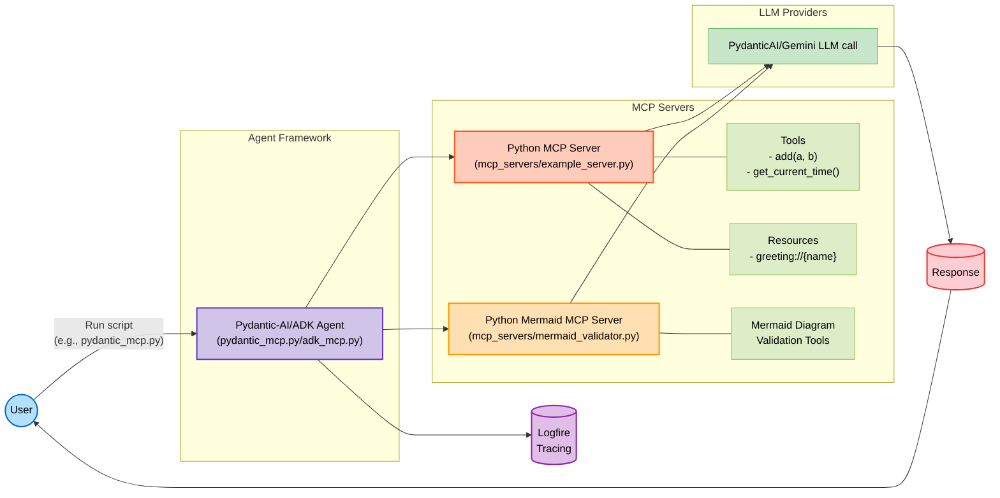
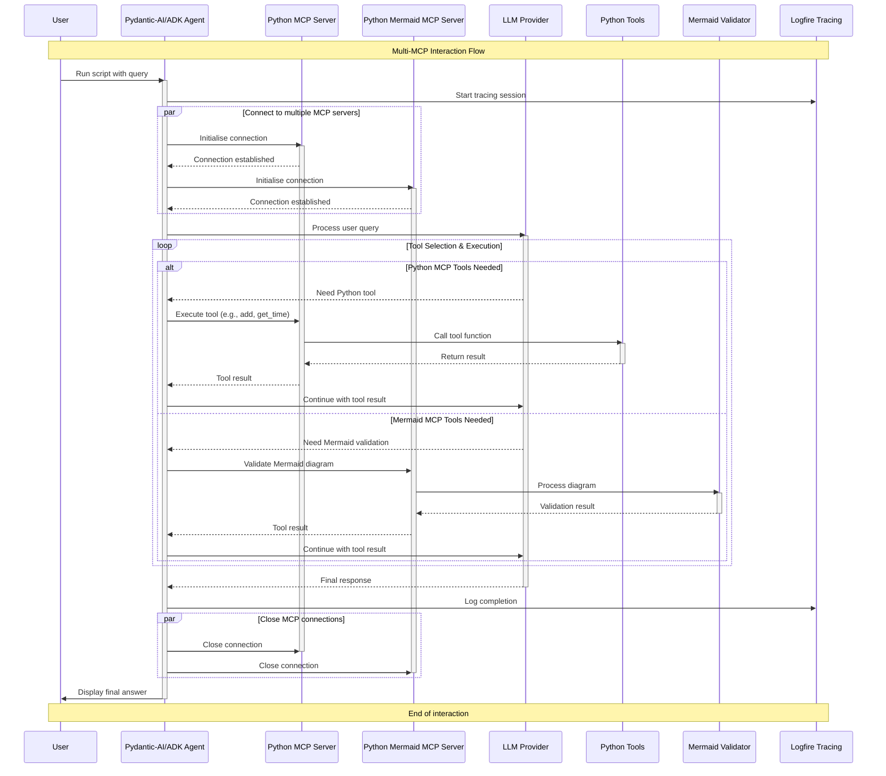

# Multi-MCP Usage

This directory contains examples demonstrating the integration of tools from multiple Model Context Protocol (MCP) servers with various LLM agent frameworks.

Agents utilising multiple MCP servers can be dramatically more complex than an Agent using a single server. This is because as the number of servers grow the number of tools that the Agent must reason on when and how to use increases. For evaluating and benchmarking these agents, please see the [evaluation suite](../evaluations/mermaid_evals/README.md).


## Quickstart

1. Configure `.env` and API keys following instructions in the [README.md](README.md)

3. Ensure the Python MCP servers can be used:
   - The Python MCP servers (example_server.py and mermaid_validator.py) are included in the repository

4. Run an example script:
   ```bash
   # Run the Pydantic-AI multi-MCP example
   uv run agents_mcp_usage/multi_mcp/multi_mcp_use/pydantic_mcp.py
   
   # Run the Google ADK multi-MCP example
   uv run agents_mcp_usage/multi_mcp/multi_mcp_use/adk_mcp.py
   
   ## Launch ADK web UI for visual interaction
   make adk_multi_ui
   
   # Run the evaluation suite
   uv run agents_mcp_usage/evaluations/mermaid_evals/evals_pydantic_mcp.py
   
   # Run multi-model benchmarking
   uv run agents_mcp_usage/evaluations/mermaid_evals/run_multi_evals.py --models "gemini-2.5-pro-preview-06-05,gemini-2.0-flash" --runs 5 --parallel
   
   # Launch the evaluation dashboard
   uv run streamlit run agents_mcp_usage/evaluations/mermaid_evals/merbench_ui.py
   ```

5. Check the console output, Logfire, or dashboard for results.


### Multi-MCP Architecture



This diagram illustrates how an agent can leverage multiple specialised MCP servers simultaneously, each providing distinct tools and resources.

### Multi-MCP Sequence Flow



The sequence diagram shows how the agent coordinates between multiple specialised MCP servers. It highlights the parallel connection establishment, selective tool usage based on need, and proper connection management.

## Evaluations

Located at [agents_mcp_usage/evaluations/mermaid_evals](../evaluations/mermaid_evals/README.md). The evaluation suite provides comprehensive benchmarking for LLM agents using multiple MCP servers.

## Example Files

### Pydantic-AI Multi-MCP

**File:** `multi_mcp_use/pydantic_mcp.py`

This example demonstrates how to use multiple MCP servers with Pydantic-AI agents.

```bash
uv run agents_mcp_usage/multi_mcp/multi_mcp_use/pydantic_mcp.py
```

Key features:
- Connects to multiple specialised MCP servers simultaneously
- Organises tools and resources by domain
- Shows how to coordinate between different MCP servers
- Includes Logfire instrumentation for comprehensive tracing

### Google ADK Multi-MCP

**File:** `multi_mcp_use/adk_mcp.py`

This example demonstrates how to use multiple MCP servers with Google's Agent Development Kit (ADK 1.3.0).

```bash
uv run agents_mcp_usage/multi_mcp/multi_mcp_use/adk_mcp.py
```

Key features:
- Uses Google's ADK framework with Gemini model
- Connects to both Python MCP server and Python Mermaid validator
- Uses new ADK 1.3.0 patterns for toolset management
- Implements proper resource tracking for MCP connections
- Shows how to handle asynchronous MCP tool integration
- Supports ADK web UI through module exports and callback-based tool attachment
- Uses a simple test case that utilizes both MCP servers in a single query

To run with the ADK web UI:
```bash
make adk_multi_ui
```

### Multi-MCP Evaluation

**File:** `eval_multi_mcp/evals_pydantic_mcp.py`

This example demonstrates how to evaluate the effectiveness of using multiple MCP servers.

```bash
uv run agents_mcp_usage/multi_mcp/eval_multi_mcp/evals_pydantic_mcp.py
```

Key features:
- Evaluates agent performance when using multiple specialised MCP servers
- Uses PydanticAI Agent evaluation to measure success of outcomes
- Generates performance metrics viewable in Logfire

## Benefits of Multi-MCP Architecture

Using multiple specialised MCP servers offers several advantages:

1. **Domain Separation**: Each MCP server can focus on a specific domain or set of capabilities.
2. **Modularity**: Add, remove, or update capabilities without disrupting the entire system.
3. **Scalability**: Distribute load across multiple servers for better performance.
4. **Specialisation**: Optimise each MCP server for its specific use case.
5. **Security**: Control access to sensitive tools or data through separate servers.

This approach provides a more flexible and maintainable architecture for complex agent systems.
