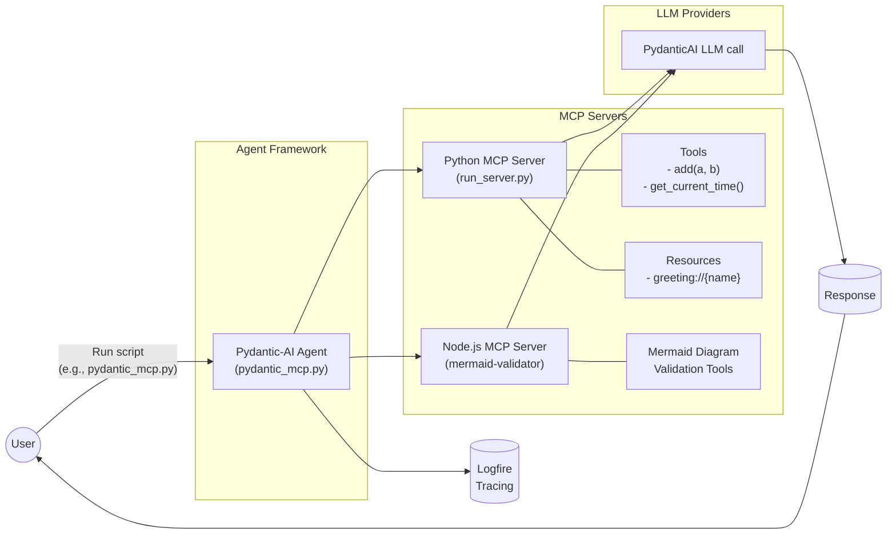

# Multi-MCP Usage Examples

This directory contains advanced examples demonstrating the integration of multiple Model Context Protocol (MCP) servers with agent frameworks.

Unlike the basic examples that use a single MCP server, these examples show how to connect to and coordinate between multiple specialized MCP servers simultaneously.

### Multi-MCP Architecture



This diagram illustrates how an agent can leverage multiple specialized MCP servers simultaneously, each providing distinct tools and resources.

## Example Files

### Pydantic-AI Multi-MCP

**File:** `multi_mcp_use/pydantic_mcp.py`

This example demonstrates how to use multiple MCP servers with Pydantic-AI agents.

```bash
uv run agents_mcp_usage/multi_mcp/multi_mcp_use/pydantic_mcp.py
```

Key features:
- Connects to multiple specialized MCP servers simultaneously
- Organizes tools and resources by domain
- Shows how to coordinate between different MCP servers
- Includes Logfire instrumentation for comprehensive tracing

### Multi-MCP Evaluation

**File:** `eval_multi_mcp/evals_pydantic_mcp.py`

This example demonstrates how to evaluate the effectiveness of using multiple MCP servers.

```bash
uv run agents_mcp_usage/multi_mcp/eval_multi_mcp/evals_pydantic_mcp.py
```

Key features:
- Evaluates agent performance when using multiple specialized MCP servers
- Uses PydanticAI evaluation tools to measure outcomes
- Compares results with single-MCP approaches
- Generates performance metrics viewable in Logfire

### Mermaid Diagrams Generator

**File:** `mermaid_diagrams.py`

A utility for generating Mermaid diagrams to visualize MCP architecture.

```bash
uv run agents_mcp_usage/multi_mcp/mermaid_diagrams.py
```

Key features:
- Creates visualization of MCP architectures
- Helps understand the flow between agents, MCP servers, and LLMs
- Customizable to represent different configurations

## Benefits of Multi-MCP Architecture

Using multiple specialized MCP servers offers several advantages:

1. **Domain Separation**: Each MCP server can focus on a specific domain or set of capabilities.
2. **Modularity**: Add, remove, or update capabilities without disrupting the entire system.
3. **Scalability**: Distribute load across multiple servers for better performance.
4. **Specialization**: Optimize each MCP server for its specific use case.
5. **Security**: Control access to sensitive tools or data through separate servers.

This approach provides a more flexible and maintainable architecture for complex agent systems.
